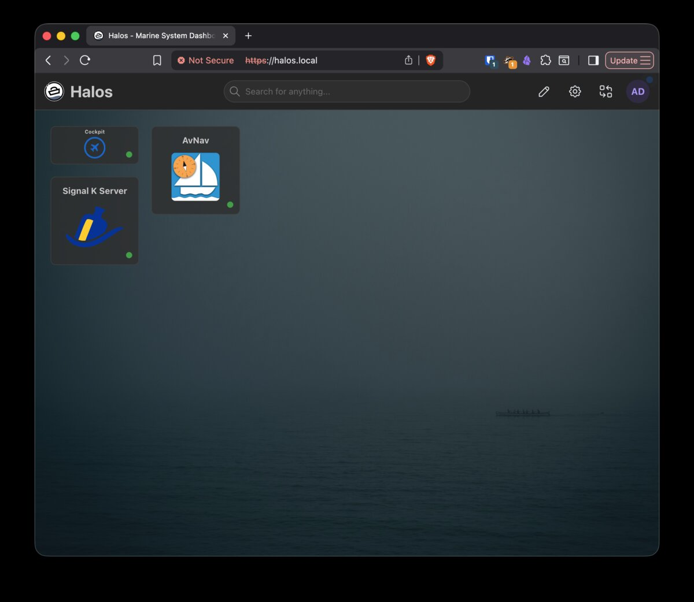
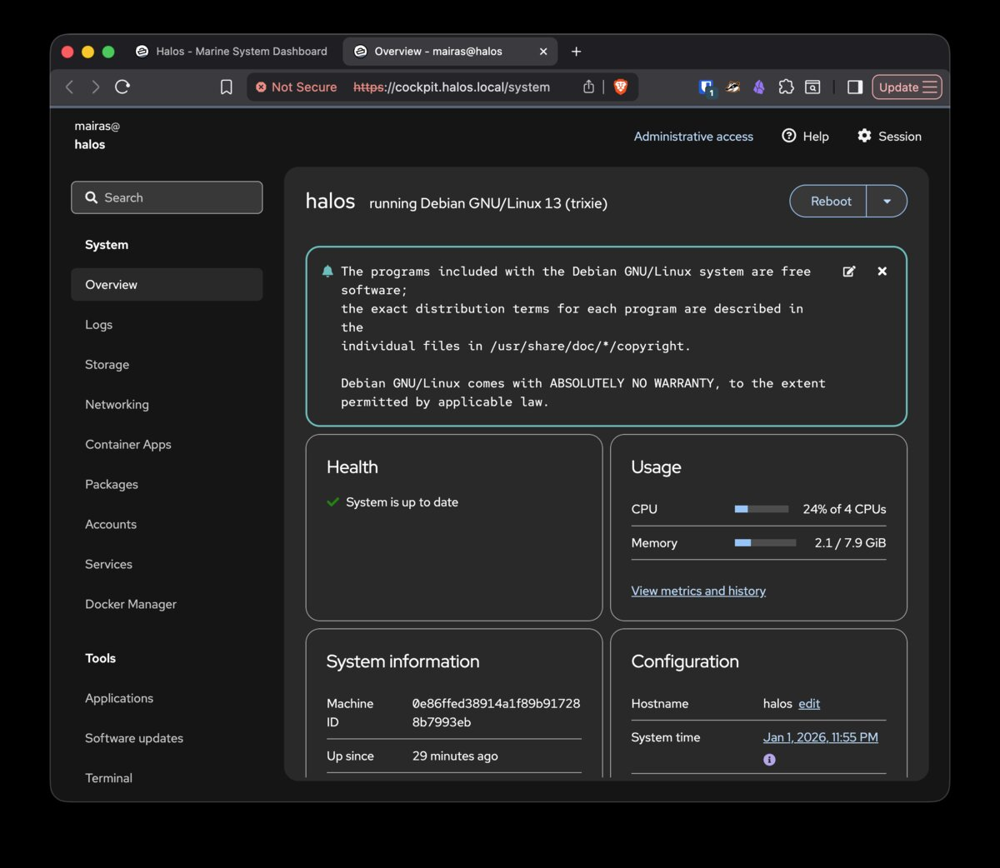
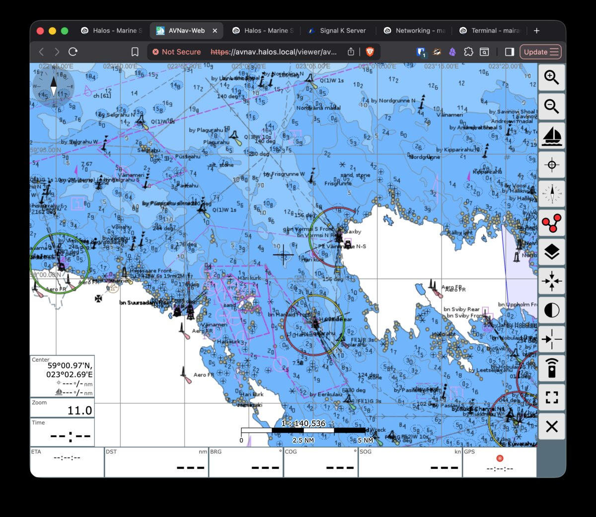

# Halos Raspberry Pi OS Distribution

> **⚠️ IMPORTANT: Work in Progress**
>
> Halos is under active development and is not feature complete. Major features are still missing. Use in production environments at your own risk. Feedback and bug reports are welcome!

Halos (Hat Labs Operating System) is a containers-first Raspberry Pi distribution with web-based management. Control everything from your browser: browse an app store, install containerized services, and manage your system. No terminal required (YMMV). Works with any Raspberry Pi 4/5 or Hat Labs HALPI2.

> Want to support this project? Consider purchasing a [HALPI2 computer](https://shop.hatlabs.fi/products/halpi2-computer)!



## Browser-Based Administration

Halos provides a **unified, browser-based administration experience**. Access the dashboard at `https://halos.local/` to see all available services. System management—packages, containers, network configuration—is available through Cockpit using standard Debian tools (APT, systemd, NetworkManager).

### Why Browser-Based?

**No Desktop or Command Line Required**: Manage your entire system from any device with a web browser:
- Configure from your laptop, tablet, or phone
- No need to connect a monitor and keyboard to your Raspberry Pi
- Access your system remotely over your local network
- Works on any operating system (Windows, Mac, Linux, mobile)

**But Still Flexible**: Desktop environment and SSH access remain available for those who prefer them.

### Key Benefits

- **Single Interface**: One place for all administration tasks via Cockpit
- **Container Store**: Browse and install containerized apps as native Debian packages
- **Standard Tools**: Built on APT, systemd, and other proven Debian technologies
- **Native Packages**: Container apps as .deb packages, managed like any other software
- **Extensible Stores**: Curated app collections (e.g., marine apps) that filter and present relevant packages
- **Vanilla Compatible**: Works on standard Raspberry Pi OS with just `apt.hatlabs.fi` repo added

## What is Halos?

Halos transforms your Raspberry Pi into a managed server platform with:

- **Unified web interface** with Traefik reverse proxy, Authelia SSO, and Homarr dashboard
- **Web-based system administration** via Cockpit
- **Container app store** via cockpit-container-apps with one-click installation
- **Marine software stack** (Signal K, InfluxDB, Grafana) for boats
- **HALPI2 hardware support** for CAN bus, RS-485, I2C interfaces and power management

**Use cases:**
- Marine electronics server for boats (NMEA 2000, instrument displays)
- Home automation and IoT gateway
- Self-hosted web applications and services
- Raspberry Pi development platform with easy container deployment

## Choosing an Image Variant

Halos comes in multiple variants to suit different hardware and use cases:

### Hardware Platform
- **HALPI2 variants**: Include drivers for Hat Labs HALPI2 hardware (CAN, RS-485, power management)
- **RPI variants**: For generic Raspberry Pi 4/5 (no HALPI2-specific drivers)

### Desktop Environment
- **Headless**: No desktop GUI, access via web interfaces only
- **Desktop**: Includes XFCE desktop environment

### Software Stack
- **Standard**: Cockpit web management with container store
- **Marine**: Adds the Marine App Store with containerized marine applications

### Available Images

| Image Name | Hardware | Desktop | Marine Apps |
|------------|----------|---------|-------------|
| `Halos-HALPI2` | HALPI2 | No | No |
| `Halos-Desktop-HALPI2` | HALPI2 | Yes | No |
| `Halos-Marine-HALPI2` | HALPI2 | No | Yes |
| `Halos-Desktop-Marine-HALPI2` | HALPI2 | Yes | Yes |
| `Halos-RPI` | Generic RPi | No | No |
| `Halos-Desktop-RPI` | Generic RPi | Yes | No |
| `Halos-Marine-RPI` | Generic RPi | No | Yes |
| `Halos-Desktop-Marine-RPI` | Generic RPi | Yes | Yes |

**Stock Raspberry Pi OS variants** (with HALPI2 drivers but no Halos web stack):
- `Raspios-lite-HALPI2`: Headless Raspberry Pi OS with HALPI2 drivers
- `Raspios-HALPI2`: Desktop Raspberry Pi OS with HALPI2 drivers

## Getting Started

### 1. Download the Image

Download your chosen image from the [Halos releases page](https://github.com/hatlabs/halos-pi-gen/releases).

### 2. Flash to SD Card or SSD

For HALPI2, follow the [Documentation flashing instructions](https://docs.hatlabs.fi/halpi2/user-guide/software.html#flashing-an-operating-system-image-to-ssd) to flash to an SSD.

For generic Raspberry Pi, follow these steps:

1. Download [Raspberry Pi Imager](https://www.raspberrypi.org/software/)
2. Insert your SD card or connect SSD via USB adapter
3. Open Raspberry Pi Imager
4. Select "Use custom" and choose your downloaded Halos image
5. Select your target drive
6. Click "Write" (do not apply OS customization settings)

### 3. First Boot

1. Insert the card/drive into your Raspberry Pi and power on
2. Wait 2-3 minutes for first boot initialization and container startup
3. Access the web interface at [`https://halos.local/`](https://halos.local/)

**Self-signed certificate warning**: Your browser will warn about the self-signed certificate. Accept/bypass this warning once per hostname to proceed. It feels like there are many warnings to dismiss, but this is a one-time setup step. Future versions will address this.

**Default SSO credentials** (Authelia):
- Username: `admin`
- Password: `halos`

**Important:** Change the default password immediately after first login via the Cockpit Users panel.

**Backup access**: If the main interface is unavailable, Cockpit is directly accessible at [`https://halos.local:9090/`](https://halos.local:9090/) (uses system user `pi` with password `raspberry`).

## Installing on Vanilla Raspberry Pi OS

Already running Raspberry Pi OS Trixie? You can install the Halos software stack without reflashing.

### 1. Add the Hat Labs Repository

```bash
# Import the GPG key
curl -fsSL https://apt.hatlabs.fi/hat-labs-apt-key.asc | sudo gpg --dearmor -o /usr/share/keyrings/hatlabs.gpg

# Add the repository
echo "deb [signed-by=/usr/share/keyrings/hatlabs.gpg] https://apt.hatlabs.fi trixie-stable main" | sudo tee /etc/apt/sources.list.d/hatlabs.list

# Update package lists
sudo apt update
```

### 2. Install Halos

Choose the variant that fits your needs:

```bash
# Base system (Cockpit + container store)
sudo apt install halos

# Marine variant (includes marine app store and Signal K)
sudo apt install halos-marine
```

The installation will set up the full Halos stack including Traefik, Authelia, Homarr, and Cockpit. Access the web interface at `https://<hostname>.local/` after the containers start (2-3 minutes).

## Using Halos

### Web Interface Architecture

Halos uses a modern reverse proxy architecture:

- **Traefik** (port 80/443): Main entry point, routes requests to services
- **Authelia**: Single sign-on (SSO) authentication for all services
- **Homarr**: Dashboard with links to all installed applications
- **Cockpit**: System administration interface

Access the main interface at [`https://halos.local/`](https://halos.local/). After SSO login, you'll see the Homarr dashboard with links to all available services.

### Cockpit System Management



Cockpit provides comprehensive system administration:

- **Overview**: System resource monitoring and status
- **Software**: Install and manage packages, including container apps
- **Terminal**: Command-line access directly in the browser
- **Services**: Manage systemd services
- **Logs**: View system and application logs
- **Users**: User account management

Access Cockpit via the dashboard or directly at [`https://halos.local:9090/`](https://halos.local:9090/).

### Installing Container Apps


1. Open Cockpit and navigate to **Container Apps**
2. Browse categories or search for applications
3. Click on an app to view details and install
4. Installed apps run as systemd services and start automatically

### Marine Apps



Marine variants include the Marine App Store with applications such as:

- **Signal K** ([`https://signalk.halos.local/`](https://signalk.halos.local/)): Marine data server and API
- **InfluxDB** ([`https://influxdb.halos.local/`](https://influxdb.halos.local/)): Time-series database for marine data
- **Grafana** ([`https://grafana.halos.local/`](https://grafana.halos.local/)): Data visualization and dashboards
- **AvNav** ([`https://avnav.halos.local/`](https://avnav.halos.local/)): Marine navigation software
- **OpenCPN** ([`https://opencpn.halos.local/`](https://opencpn.halos.local/)): Chartplotter and navigation software

Install these from Container Apps in Cockpit. Each subdomain requires accepting the self-signed certificate warning on first access.

### Terminal Access

- **Via Cockpit**: Click "Terminal" in the left sidebar
- **Via SSH**: Enabled by default in headless images. For Desktop images, enable via Cockpit Services: `sudo systemctl enable --now ssh`

## Known Issues

**First boot timing**: Container services (Traefik, Authelia, Homarr) take 2-3 minutes to start after boot. The main interface at `https://halos.local/` won't respond until all containers are running.

**Container store requires update**: Before the container app store is functional, run a system update:
```bash
sudo apt update && sudo apt upgrade
```
This can be done via the Cockpit terminal.

**Self-signed certificates**: Each hostname requires accepting the browser security warning once. If you change the hostname, you'll need to accept the certificate again for the new hostname.

## Roadmap

- **Expanded app catalog**: More marine and general-purpose container apps
- **Let's Encrypt certificates**: Automatic HTTPS certificates for public-facing installations

### Get Involved

- **Discussions**: [GitHub Discussions](https://github.com/hatlabs/halos-distro/discussions) - Ask questions, share ideas, and connect with other users
- **Follow Progress**: [GitHub Issues](https://github.com/hatlabs/halos-distro/issues)
- **Provide Feedback**: Open issues with feature requests or bug reports
- **Contribute**: See individual component repositories for contribution guidelines

## Development

This repository acts as a workspace manager for all the components that make up Halos.

### Repository Layout

- **halos-pi-gen/** - Custom Raspberry Pi image builder based on pi-gen
- **apt.hatlabs.fi/** - Custom APT repository for Halos packages
- **cockpit-apt/** - Cockpit package manager with store filtering
- **cockpit-authelia-users/** - Authelia user management for Cockpit
- **cockpit-container-apps/** - Container app management UI
- **cockpit-dockermanager-debian/** - Docker manager Cockpit plugin
- **cockpit-networkmanager-halos/** - Cockpit NetworkManager with WiFi features
- **container-packaging-tools/** - Tool for generating container .deb packages
- **halos-cockpit-config/** - Cockpit HaLOS config and branding
- **halos-core-containers/** - Core app definitions (Homarr, Traefik, Authelia)
- **halos-homarr-branding/** - Homarr HaLOS branding package
- **halos-imported-containers/** - Auto-imported apps from CasaOS, Runtipi, etc.
- **halos-marine-containers/** - Marine app definitions and store configuration
- **halos-mdns-publisher/** - mDNS hostname publisher daemon
- **halos-metapackages/** - Halos and Halos-Marine metapackages
- **homarr-container-adapter/** - Homarr first-boot setup and container discovery
- **opencpn-docker/** - OpenCPN Docker image
- **shared-workflows/** - Reusable GitHub Actions workflows

Each repository is independently managed. The `./run` script provides convenience commands for cloning and updating all repositories at once.

### Development Quick Start

```bash
# Clone all component repositories
./run repos:clone

# Update all repositories to latest
./run repos:pull-all-main

# Check status of all repositories
./run repos:status

# Build an image (requires Docker)
cd halos-pi-gen
./run docker-build "Halos-Marine-HALPI2"
```

Each repository has its own `AGENTS.md` with detailed development documentation.

## Contributing

Contributions are welcome! Each component repository accepts pull requests independently. See the individual repository documentation for specific guidelines.

## License

See individual component repositories for license information.
